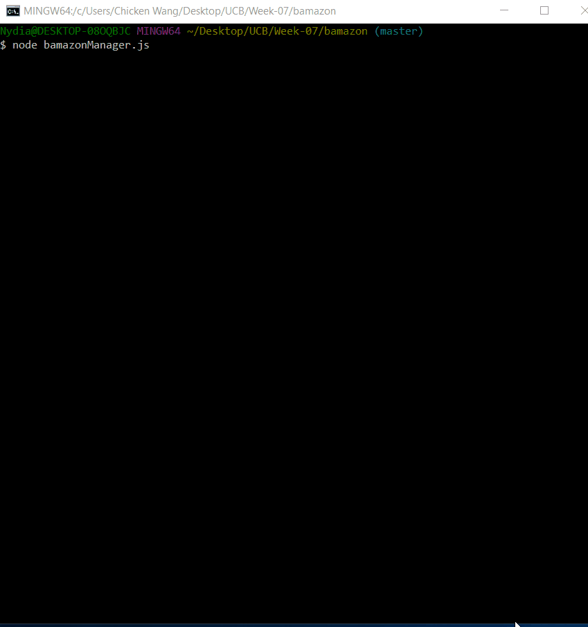

# bamazon

## Description
This application built as an Amazon-like storefront with the MySQL skills, which it is based on a simple command line. The app will take in orders from customers and deplete stock from the store's inventory with two interfaces: **custormer** and **manager**.

### MySQL Setup
You should have MySQL database set up on your computer in order to run this APP. If you do not have, you can  install from [MySQL installation page](https://dev.mysql.com/doc/refman/5.6/en/installing.html). Once you installed, open the `bamazon.sql` in the MySQL and create the table to populate the database. 

### Bamazon Customer Interface

1. Frist, it displays all the items by item id for the customers.

2. At the bottom of the items list, custormers will answer the items' ID to get the item.

3. Next, they will enter the quantity of the item.

	- If the item is in stock, it will tell it is in stock and place the item with the cost.

	- If the item is not in stock, it will tell `Insufficient quantity!`

### Bamazon Manager Interface
Bamazon manager interface allows users to view, change or edit the inventory for any products. The users will see the options as the following:

* View products for sale

* View low inventory

* Add to inventory

* Add a new product

